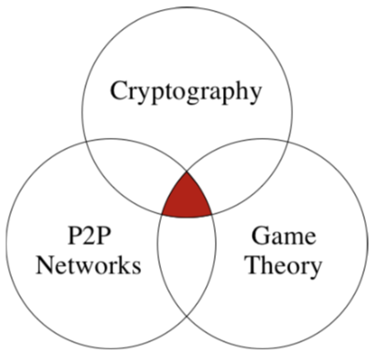
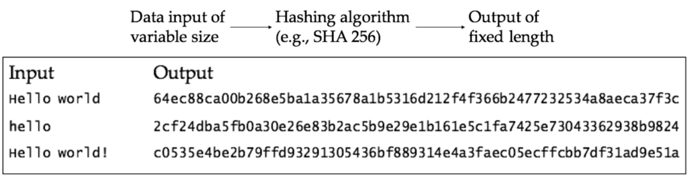
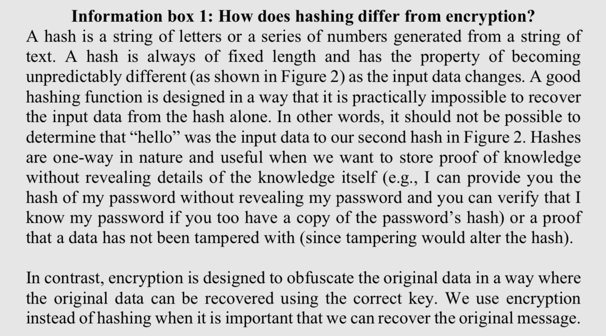

# THE EXCHANGE OF VALUE: FROM CASH AND CREDIT TO DIGITAL LEDGERS
The central problem that Bitcoin's creator(s) [Satoshi Nakamoto](https://en.wikipedia.org/wiki/Satoshi_Nakamoto) wanted to solve was the exchange of value in a Peer-to-Peer manner without the involvement of any central coordinator or third party actor. To truly understand blockchains, one must first understand value exchange.

**Learning outcomes**
- To understand the role of credit and cash in value exchanges.
- To understand why intermediaries exist.
- To learn about chained ledgers and be able to describe their role in various ledgers.
- Understand how hash links are used in chained ledgers.

## Value exchanges: The role of credit and cash
*Credit and cash exists to reduce the problem of coordinating a series of wants&mdash;e.g., a specific good or service at a certain time in exchange for something else&mdash;between transacting parties.*

Imagine a very simple case where value is being exchanged between two parties, here referred to as 𝐴 and 𝐵. In this first simple example, 𝐴 has something 𝐵 wants and 𝐵, in turn, offers something to 𝐴 of equivalent value. For example, 𝐴 can give a banana to 𝐵 in exchange for a coconut. Such a barter system works well when the exchange of value is equivalent and when the time of the value exchange suits both parties.

However, in most cases it is hard to coordinate value exchanges. For instance, one could easily imagine a case where 𝐴 has something 𝐵 wants today, but 𝐵 can only offer an equivalent exchange at a future date. This is a temporal misalignment that is rather inconvenient. Historically, this problem of ‘wants’ that are separated in time has been solved in one of two ways: i) credit, and/or ii) cash.

Using credit, 𝐵 can take on a debt that needs to be settled at a future date. But this is risky for 𝐴 as 𝐵 may not be able to settle the debt at a later date. To mitigate this risk, 𝐴 can demand a collateral and/or charge an interest. The second option is to use cash as a *medium of exchange*. Cash offsets the liability of debt and functions as a settlement mechanism that facilitates trade when needs are different over time.

Credit and cash are important not only for solving temporal misalignment in value exchanges, but also to allow multiple parties to engage in trade. Without credit and cash, a barter system would simply not work. It would not work because there needs to be a mechanism that coordinates value exchanges among multiple participants with diverse needs both in terms of goods and services as well as the time of delivery.

There is another reason why credit and cash is useful. In addition to temporal misalignment, the parties in the exchange may not be able to offer each other an equivalent exchange. To get around this problem, an effective medium of exchange needs to be *divisible*. Say for instance that 𝐴 has a cow and 𝐵 has a tool. They both agree that the tool is worth half a cow. This exchange may prove problematic since a (living) cow is only partially divisible. In contrast, cash, e.g., a 100-dollar bill, is highly divisible and can be exchanged for other denominations.

Divisibility is not the only characteristic that is important to facilitate a value exchange. For instance, to exchange value, both 𝐴 and 𝐵 need to transport the value to the exchange point. *Portability* thus becomes another important characteristic. Similarly, *durability* is important so that the transport does not destroy the value. Finally, cash (and arguably credit) has the additional benefit of being widely accepted and possessing a high level of *uniformity*. These two characteristics facilitate coordination.

In addition to serving the function of being a medium of exchange, credit and cash also facilitates value exchange by acting as a *store of value* and by being a *unit of account*. A coconut is a poor store of value (it rots). In contrast, a gold nugget is better because it persists over time. As a unit of account, credit and cash is useful because they act as a standard measurement unit of all economic value as long as the total supply is known to the transacting parties.

## Value exchanges in an online environment
*Summary text*

When you make a purchase on the internet using your credit card, the seller will take the information you have provided and run it through a whole series of intermediaries that fill different functions. For instance, you have payment processors, banks, credit card companies, and various other actors who are all part of the payment system.

When giving your credit card information to an online seller you actually provide more information that is necessary for the value exchange to take place. Ultimately, the seller only cares about being paid for the goods and services provided (we can here ignore other factors such as regulatory compliance). Paypal is an example of an intermediary that handles your credit card information, approves transactions, and notifies the seller of the approval. That way, a seller receives payment without having accessed the customer’s credit card information.

But why do these intermediaries exist? What are the problems they solve? And why does blockchain claim to disintermediate industries? When the internet was new in the 1990s, there was a high interest in intermediaries that could safely connect buyers and sellers. Back then, the protocol-level encryptions we enjoy today were not yet commonplace and sending your payment information online over an unsecured communication channel was considered risky. Intermediaries emerged to mitigate this risk in different ways.

Some intermediaries operated as contact points between buyers and sellers. Buyers could enrol into the system and provide their credit card information to a trusted party. Sellers could then send the purchasing details to this trusted intermediary who would charge a customer’s credit card if that customer confirmed the accuracy of the payment.

But acting as a contact point is cumbersome from a coordination perspective. Another way intermediaries help secure payments was to get buyers to encrypt their transaction details together with their credit card information and then pass this encrypted information to the seller. The seller, who had no way of decrypting the information, would then send this information to the intermediary. That intermediary would then, in turn,  decrypt the message and approve the transaction only if the decrypted message from the seller matches the information from the buyer. However, this encrypted setup requires burdensome trusted certificates.

Let us look at how some of today’s well known intermediaries, e.g., VISA and MasterCard, operate as trusted intermediaries. First, we need to ask ourselves: what is trust, really? The examples above only highlight trust in terms of privacy and security in terms of sending credit card information. But the concept of trust is broader than that. A full account of what trust actually is lies beyond the scope of this text, but it is sufficient to say that:

- Both buyers and sellers need to feel secure that payments are not made with counterfeits.
- Both buyers and sellers need to be able to trust that a payment is made from where it should be made and that this payment arrives where it should arrive.
- There needs to be a way to manage account information in such a way that a seller can feel confident that a buyer has sufficient funds, and
- Account balances need to be updated to accurately reflect the value exchange.

<!---REFER BACK TO THESE POINTS LATER AND COMPARE WITH BLOCKCHAIN. ALSO EXPAND ON TRUST CONCEPT--->

Each of these points are essential components of trust in value exchanges. But they have been notoriously difficult to satisfy in an online environment. One reason for this is that digital information is not sent from one party to another, as is cash or goods, but is actually copied over from one place to another.

## The double spend problem
*Summary text*

The ability to copy digital data creates a rather annoying problem known as *the double spend problem*. In essence, the double spend problem relates to the risk of a digital currency being spent twice through copying digital information. In contrast, an object in the physical world, such as a cash note, cannot exist at two places at the same time. If I hand over a note to another person, I cannot hand that same note over to another person unless I physically get it back.

The double spend problem exist in the digital world since transactions here happen essentially by creating copies. So, we need a way to track digital cash. One way to achieve this tracking is to use *digital signatures*. Using digital signatures, we can sign each digital note, which would allow us to track copies. In a world of perfect information, where everyone knows everything, these digital signatures would solve the double spending problem because a seller would not accept a note with a digital signature that exists as a copy somewhere else.

But we do not live in a world of perfect information. This is where the intermediaries become important. They can coordinate the exchange of digitally signed notes in such a way that the account balances are accurate and that double spending is prevented. To do so, these intermediaries must maintain *ledgers* of all the digitally signed notes and how they are exchanged. Effectively, sellers outsource the prevention of double spending to these trusted intermediaries.

There is of course a lot more to digital payments than what is covered here. For those of you who want to know more about how these digital payment systems work, I can strongly recommend starting by reading the work of David Lee Chaum. It is, however, noteworthy that: 1) all of these payment systems require intermediaries and trusted third parties that run a ledger, and 2) all of these payment systems pegged the value of the digital cash to another asset such as the dollar or, in some cases, gold.

So far, we have discussed why intermediaries exist and how they secure trust in online trade. We mentioned that trusted intermediaries maintain ledgers in order to verify and coordinated digitally signed payments. Next, we take a closer look on ledgers. More specifically, we take a look on a very special kind of ledger known as a blockchain. The reason why the blockchain is interesting, is because this ledger is designed in such a way that it eliminates the need for trusted third parties.

## From chain documents to chained ledgers
*Summary text*

To understand how a chained ledger works, we need to first understand how a cryptographic chain is established (which requires us to understand cryptography too, but more on that later). In 1991, Haber and Stornetta presented a method of digital document time-stamping with catenate certificates. In their [patent abstract](https://patents.google.com/patent/US5136646A/en) they write:

>The agency then certifies the receipt by adding and hashing the receipt data with the current record catenate certificate which itself is a number obtained as a result of the sequential hashing of each prior receipt with the extant catenate certificate.

The patent abstract refers to a way to create a chain of documents where each document becomes part of the content of the next document. In doing so, it is possible to create a document chain where each subsequent document contains a part of the entire history of all the documents that precede it. Figure 1 illustrates this concept.

Figure 1. A document chain

The idea behind linking documents like this is to create a “chain” of documents where each document contains a reference to every single document that preceded it.

Document chains allow us to detect attempts of data tampering. If you posses the green document in Figure 1, and a malicious actor tampers with the orange document, then you would know as your document is contains the tampered one.

This embedded copy principle is the basic idea for chaining documents. But embedding each document into the next is not practically feasible because each additional document would require us to store copies of the entire chain of documents that precede it. This means that each new document more than doubles the stored data. This is a big problem. If a document contains a single random word and the embedded previous document, a document chain of 37 documents would contain 2^37 + 1 ≈ 229 million pages (just short of twice the amount of book pages in existence).

### Hash links
A solution to this data inflation problem, is found in the Haber and Stornetta patent. In their abstract, we can find the word “hashing.” Hashing refers to the application of a hash function to a data of arbitrary length, e.g., the content of a document. In simple terms, a hash function is a function that can map data of any length to data of a fixed length. Figure 2 illustrates this.

Figure 2. Hash inputs and outputs

Note how the input length does not matter for the output length. Note also how any small difference in the input completely changes the output. In addition, the output changes in an unpredictable way,  meaning that it is not possible to guess what the new output will be when the input changes. Using hashing functions, we can create ‘digital fingerprints’ of data since a given input will always generate the same hash output.

[Hashing is not the same as encryption](https://stackoverflow.com/questions/4948322/fundamental-difference-between-hashing-and-encryption-algorithms). These two words, hashing and encryption, are often incorrectly used interchangeably (Information box 1 explains their differences).

Information box 1.

Let us now apply the hashing to the previous chain of documents. Remember that a hash function takes as an input data of any length and always returns an output of fixed length. In addition, for all practical purposes, the hash output will always be unique. Mathematically speaking, the space of possible inputs is infinitely larger than the space of hash outputs, but if we select a hashing algorithm that generates outputs of sufficient length it is practically impossible to find two different inputs that create the same hash output. The difficulty of finding two inputs that hash to the same output is called the ‘collision resistance property’ of the hash function. Take for instance SHA-256, the hash function that Bitcoin uses. It has 2^256, possible hash outputs for what is an infinite set of inputs. So, while in theory, it has an infinite set of collisions, in practice it is impossible to find a single one given how big of a number 2^256 is.

If we apply this property to our document chain, we can simply take a document, hash it, and include the hash as part of the next document. Since it is practically impossible that two different documents would generate the same hash output, we can cryptographically link the documents using hash outputs.

[A good example is this one](https://anders.com/blockchain/)

Since hash functions can take any kind of data as input, we can easily see how the documents in our example could be replaced with for instance a ledger containing information about economic transactions. This way of linking data is what Satoshi Nakamoto used to ensure that blockchain ledgers are *tamper proof* and *immutable*. Read more here.

What we have now is a way to create unique digital copies. This effectively solves a large problem, i.e., the double spend problem, that made it difficult for us to exchange value in an online environment without relying on central coordinators or trusted third parties. Hash linked ledgers are not the whole solution, but a very important part of the solution.
