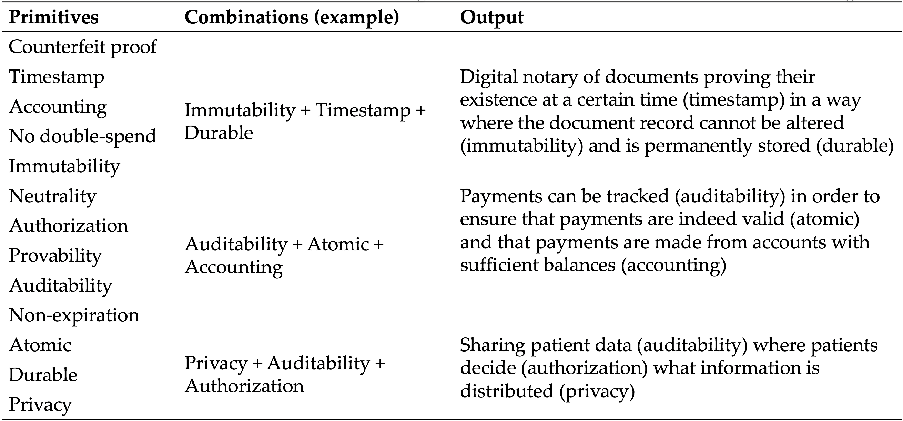

# CONSENSUS ALGORITHMS: SUMMARY
*A blockchain based system has the properties of its consensus model.*

<b>Learning outcomes</b>

- Learn about different consensus algorithms
- Understand the role of consensus algorithms in distributed systems
- Understand when a particular consensus algorithm is suitable and when it is not suitable

## Common types of consensus algorithms
### Competitive
*Competitive consensus algorithms are those where users devote some amount of resources to earn the right to validate a block.*

**Proof of Work (PoW)**: PoW is a puzzle competition. Computers, called “miners,” try to solve a mathematical puzzle. Once solved, a miner can validate transactions by adding them to a list of transactions called a block. These blocks are chained using cryptographic links.

**Proof of Capacity (PoC)**: Similar to PoW, but users rely on their memory or disk space to mine.

**Proof of Stake (PoS)**: PoS is a lottery game. A user can designate some of his or her tokens to a lottery. The amount of the tokens the user stakes, influences the change of winning the lottery. The winner gets the rights to validate a block with transactions.

**Proof of Burn (PoB)**: Similar to PoS, but users get lottery tickets proportional to the amount of tokens they send to a locked wallet that nobody can access.

**Proof of Weight (PoWe)**: Similar to PoS. Instead of tokens, users put forth something else (e.g., importance, disk space, or activity etc.) in return for lottery tickets.

### Elective
*Elective consensus algorithms are those where users elect their validators.*

**Delegated Byzantine Fault Tolerance (dBFT)**: Regular nodes vote for delegates who keep track of all the transactions on the network. A lottery then decides who among the delegates gets the right to propose a block. If ⅔ of the delegates agree with the proposal, that block is validated.

**Practical Byzantine Fault Tolerance (pBFT)**: A smaller number (around 20) of nodes communicate with each other and validate blocks. As long as more than ⅔ of the nodes are honest, everything runs smoothly.

**Simplified Byzantine Fault Tolerance (sBFT)**: Similar to pBFT but with a single known validator who bundles together proposed transactions into a block proposal. Block signers, who all know each other, then vote for validating the proposed block.

**Federated Byzantine Fault Tolerance (fBFT)**: Nodes maintain a public list of trusted validators. Nodes then propagate transactions that have been validated by the majority of these publicly trusted validators.

Delegated Proof of Stake (dPoS): Similar to PoS, but users select the players who can enter the lottery game.

### Hybrid
*Hybrid consensus algorithms are those where users elect their validators, who then compete for the right to validate a block.*

**Proof of Elapsed Time (PoET)**: PoET uses a randomized waiting game. Block validators are assigned random waiting times and then go to sleep. The one that wakes up first wins the right to validate a block.

**TABLE A**. One way to group consensus algorithms.

|  | *Pu*blic | *Pe*rmissioned |
|---------------|--------------------------|--------------|
| ***Ce*ntralized** | dBFT, fBFT, dPoS | pBFT, sBFT |
| ***De*centralized** | PoW, PoS, PoC, PoB, PoWe | PoET |

1. **PuCe**: Suitable for projects where network performance is crucial, and where there delegate nodes suffer economically, socially, or institutionally from dishonest behavior.
2. **PuDe**: Suitable for projects where transactions take place in adversarial economic environments that lack any other established coordination point around which economic activity could be organized.
3. **PeCe**: Work as existing databases do. Suitable were existing centralized databases work.
4. **PeDe**: Novel combination. Developed, deployed, and maintained by heavy tech companies (e.g., Intel and IBM). Industry suitability is too early to tell, but it is promising for cases where a third party is used to outsource ICT related risks.

# CONSENSUS ALGORITHMS
Show where consensus plays a role visually.
Transactive part → transactions are kept in a pool of unvalidated transactions → validators select transactions from the pool and group them up for validation → CONSENSUS MECHANISM PART this is where grouped transactions are placed in a proposed block + where the algorithm decides who has the right to validate the block → validated block is appended to the ever growing chain of blocks → nodes propagate the validated block and the transaction is complete.

## The fundamentals of consensus algorithms
Distributed consensus is an essential part of any blockchain network and it involves the process by which agreement is reached around a shared data state. Blockchains utilize consensus algorithms to do two main things. Firstly, the consensus algorithm must ensure that there exist an agreed upon record of past data states. Second, the consensus algorithm governs how the additions are appended to the existing record. Put simply, the consensus algorithm is how blockchains ensure a final agreement around a single unique data state among a number of distrusting nodes.

To achieve a single unique data state among distrusting nodes, there are various requirements that must be met. These are as follows:

- *Safety*: All the honest nodes agree on the same state (one proposed by an honest node) and only nodes that follow the network’s rules can propagate information related to state changes
- *Liveness*: All honest and functioning nodes eventually produce a value
- *Fault tolerance*: Nodes must be able to reach state agreement in the presence of faulty or Byzantine (dishonest) nodes

There exist many different kinds of consensus algorithms that can fulfil the above mentioned requirements. However, no deterministic consensus protocol can simultaneously fulfil all three in an asynchronous system. In distributed systems, fault tolerance is, by definition, crucial. Thus, consensus algorithms must favor either safety or liveness.

There exist two general categories of consensus algorithms: (1) Elective off-chain consensus, and (2) Competitive on-chain consensus. Those consensus algorithms that fall under the first category, make their decision based on a given number of nodes who publish their signed messages (this number varies depending on the specific design). Those that fall under the second category, reach consensus when a predetermined competition is completed. The basic functioning principle of both categories are illustrated next.

IMAGE ABOUT HERE THAT ILLUSTRATES THE FOLLOWING
Elective cases: I) Everyone must sign the state proposal (absolute voting), II) a given portion must sign the state proposal (qualified/majority/relative/absolute voting), III) particular elected nodes must sign the state proposal.
Competitive cases: illustrate this with several actors playing sudoku of equal difficulty and where the first to publish the solution gets the right to sign the state proposal by those that have verified the solution.

http://thesecretlivesofdata.com/raft/ use this style for all.

Every consensus algorithm falls completely or partially within each of these two categories. Let us now look closer at some of the more notable consensus algorithms that exist. We begin with competitive algorithms where we provide an overview of PoW and PoS, followed by some other commonly employed consensus algorithms within this category. We then look at elective algorithms and describe how they work. Finally, we describe some hybrid forms.

### Competitive algorithms
The many variations of competitive algorithms all rely on devoting resources (e.g., physical electricity or non-physical money) to increase their chance of earning the right to propose and validate blocks with data (e.g., transactions).

**Proof of Work (PoW)**: A well tested algorithm that relies on computational resources being spent on solving a mathematical puzzle. Those who attempt to solve this puzzle are referred to as miners and the puzzle they are trying to solve can be stated as $$H(Block header data) < nBits$$ target difficultywhere H()is the hash digest (the answer) of input data fed into a hashing algorithm (read more here). Since it is possible to quickly and accurately approximate the amount of work that was put into solving this mathematical puzzle, the valid chain is naturally considered to be the one with the most work put into it. This provides a point of coordination around which consensus can be reached. In public chains, the amount of computational resources spent on solving the puzzle—commonly referred to as hashing power—can vary. As such, PoW systems utilize difficulty changes in runtime to ensure a constant average block generation time in the presence of variable hashing power.

- *Benefits*: Well tested and the only objectively verifiable method we know of.
- *Drawbacks*: Slow and energy intensive with unfair economies of scale (mining farms).

**Proof of Stake (PoS)**: This algorithm relies on the concept of having an adequate stake in the system in order to be able to participate in validation. The idea is that a sufficient stake will deter malicious attempts to attack the network. Here, a validator uses its stake and place a bet on a block they believe is valid. If that block gets approved, the validator collects the fees from the transactions included in that block. Similar to how mining power is used to solving a puzzle, PoS relies on various token characteristics (e.g., the stake’s age and the staked quantity) to determine the chance of proposing and signing the next block. Unlike PoW, PoS does not rely on a physical reality to secure a coordination point for consensus. This has both benefits and drawbacks. One big benefit is that PoS consumes far less energy. One troublesome drawback is something called the “nothing at stake” problem. This problem is a consequence of not having a physical reality such as energy usage to secure a coordination point. In the event of a fork, the number of tokens remain the same on both chains and there is nothing to deter a validator to stake their coins on multiple histories (in fact, it is the rational thing for them to do). You can read more about this problem here.
Recent PoS protocols, e.g., Ethereum’s casper, actively try to punish such unwanted validator staking behavior. However, no matter what is done, PoS can never be as objectively verified as PoW. But it does not need to be in a pragmatic sense and its objective nature may even become problematic (read more here and here).

- *Benefits*: Tested and energy efficient. Costly to attack with fair economies of scale.
- *Drawbacks*: No objective coordination point for consensus to emerge. Lack of links to a physical reality.

In addition to the two most popular solutions, i.e., PoW and PoS, there are other consensus algorithms that employ some concepts from either, but often with some additional feature. For instance, in Proof of **Deposit (PoD)**, nodes make a security deposit before the join in the mining. This deposit is what grants nodes the right to propose blocks. Conversely, **Proof of Burn (PoB)** relies on a concept where the aspiring validator sends tokens to a public address without a private key. Here the sent tokens cannot be retrieved, these “burned” tokens (which often decay over time) are then used as a stake in the lottery. Some consensus algorithms, like **Proof of Importance (PoI)**, monitors usage and movement of tokens by the users in addition to the size and time of the stake. The idea is that more important users should have a higher probability of proposing a block. Others, like **Proof of Activity (PoA)**, rely on a combination of PoS and PoW to ensure that validators are selected in a pseudorandom but uniform fashion (e.g., by looking at the n-th digit of a hash digest). Blockchains that add some weighting criteria or rely on a combination of PoW and PoS often attempt to create a consensus algorithm that facilitates consensus in a given context (e.g., importance in media). Alternatively, combining features, like in PoA, can lead to comparatively more energy efficient usage while maintaining good enough levels of security for an intended use case.

There is also a set of consensus algorithms where some other stake than tokens act as the lottery ticket. Here, we refer to these consensus algorithms as **Proof of Weight (PoWe)**. So, rather than staking tokens over time to increase the stakers probability of discovering the next block, the probability could be based on some other relatively weighted value, such as reputation, importance, space etc. As such, these consensus algorithms share similar benefits with PoS, but often lack the economic incentives represented by a high worth stake (e.g., removing the staked hard drive space is not as big of a deterrent as a financial loss). This is problematic since economic incentives are important for blockchains to function properly; without these incentives, there is nothing to guide behavior in the network. Some examples of these algorithms include **Proof of Storage (PoSt)** where storage capacity is used. Several variations of PoSt have been proposed, such as Proof of Replication, Proof of Data Possession, Proof of Space, and Proof of Space-Time.

### Elective algorithms
In contrast to competitive algorithms, elective algorithms require some kind of trusted party to propose and validate blocks. Admittedly, trust is a non-physical resource just as money, but differs in terms of fungibility, durability, portability, cognizability, and stability of value. By requiring trust in individual human and non-human actors, elective algorithms promise higher performance at the expense of requiring trust. In environments with adversarial agents present and where value exchanges are purely digital, elective algorithms may have severe drawbacks. But most economic exchanges between agents require some kind of real world performance consisting of physical events (e.g., take letter from point A to point B). Since physical events often rely on trust between parties, there is a case to be made for elective algorithms in permissioned blockchains. Especially when interactions are repeated. Below we first look at the most centralized version of elective consensus algorithms. Then we look at the elective forms of PoW and PoS. We finally describe algorithms that are derived from early work on Byzantine Fault Tolerance.

**Proof of Authority (PoAu)**: The most centralized form of elective algorithms. Here, a set of approved nodes take responsibility for validating transactions and proposing blocks. Normally, PoAu relies on known accounts and work well in situations where there exist strong off-chain incentives for honest behavior and where macro-institutional forces adequately guarantee honest behavior. Some consider PoAu a euphemism for centralized node control. Others argue that decentralized trust does not matter in contexts where events rely on centralized control. Regardless of stance, PoAu is suitable for permissioned blockchains where energy efficiency and performance is more important than decentralized trust. However, it is not very novel and prospecting users who seek to explore the disruptive potential of blockchain technology should scrutinize any collaboration partner to determine whether or not that partner’s blockchain solution is truly disruptive and novel or simply some implementation of PoAu.

**Delayed Proof of Work (dPoW)**: Two different kind of nodes, notary and normal nodes, work together to facilitate consensus. Notary nodes are elected by the blockchain and these nodes then take turns to notarize blocks onto another blockchains that uses PoW or PoS. The idea is to “piggyback” on-top of a more secure network and attach hash digests of your own blockchain to create a tamper resistant audit trail. In the event the notary nodes fail, the normal nodes can continue to operate in a PoW fashion.

**Delegated Proof of Stake (dPoS)**: Each node with a stake in the network can delegate the validation of transactions to another node by a process of voting. These elected nodes then form a set that proposes blocks and validates data states (e.g., transactions). As with dPoW, elected validator nodes then take turns on voting for blocks on behalf of the stake holders, and to validate the previous block’s authenticity (i.e., that it was signed by a trusted validator). Most implementations employ a replacement pool with standby validator nodes in case one validator node fails. While very efficient and fast, dPoS has centralization tendencies where high stakes participants can vote themselves into becoming validators. Now, as with PoAu, centralization tendencies are not necessarily bad. But lacking both the reputation based stake that comes with known identities and a macro-institutional framework to guarantee honest behavior can be problematic. Especially if the transaction fees that the elected validators earn drop in value. It has also attracted a lot of criticism from notable members of the blockchain community, e.g., Vitalik Buterin and Nick Szabo (read more here and here).

**Byzantine consensus models (pBFT, fBFT, dBFT, sBFT)**: Byzantine Fault Tolerance is not a consensus algorithm on its own, but rather the ability of a distributed network to reach consensus in the presence of malicious or faulty actors. Byzantine Fault Tolerance has been extensively research over the decades and is used all over the world to secure distributed databases. Some derivations of this work has been implemented in some popular blockchain platforms.

**Practical Byzantine Fault Tolerance (pBFT)** is one example of a BFT algorithm. As most other BFT algorithms apply some concepts from pBFT, we will explore it first. One notable thing with pBFT is that it assumes that certain specific nodes are dishonest or faulty. It was designed as a high performance consensus algorithm. As such, it relies on a set of trusted nodes. The nodes in a pBFT model are ordered sequentially with one being the leader and the other nodes act as backups. When someone sends a request to the leader node, that leader nodes informs the backup nodes about the request, and then executes the request. The leader then informs the request originator about the request result, who then awaits replies from others nodes with the same request result. This leader backup node design means that decisions are made through majority votes where each node communicates with other nodes in order to prove the origin of a signed message and that it has not been modified. To guarantee progress and consistency in the data state the system needs 3f+1nodes to be able to tolerate f faults, and there are several safeguards in place to ensure operations. For instance, the leader node can be replaced if a supermajority of the honest nodes consider the leader to be faulty.  
It is important to note that pBFT was designed for practical applications in mind. It is not the outcome of an exercise in cryptoeconomic incentive alignment, and it makes no claims of working in conditions where PoW or PoS would be more beneficial. Having a more practical orientation in mind, it was also not designed to handle a large number (read >20) of unknown nodes (most economic exchanges where events are involved currently have no use for this) due to the heavy communication between the nodes. However, pBFT does offer state finality meaning that once a data state is updated it needs no confirmations. When agreement is reached around a data state change, that state change is final. This has major benefits in contexts where finality is important. Also, many of its inherent weaknesses can be overcome when it is used in combination with other consensus algorithms, e.g., PoW for public blockchains or by simply relying on a permissioned design.

**Federated Byzantine Fault Tolerance (fBFT)**: Similar to pBFT, but nodes in this protocol rely on a set of publicly trusted validator nodes. The nodes only propagate blocks that have been validated by the majority of these trusted nodes. One key difference between fBFT and pBFT is that the former does not require a maintained list of trusted nodes (read more here). This increases the safety of the network against malicious actors, but it comes at the cost of performance and communication latency. Another variation is **Delegated BFT (dBFT)**. In this variation, nodes participate in consensus through proxy voting. Token holders can vote for the validator they wish to support. When ⅔ of the set of elected validators reach a consensus around what goes into each block, the block is generated and finality is achieved. Finally, we have **Simplified Byzantine Fault Tolerance (sBFT)**. It is similar to pBFT but with a single known validator who bundles together proposed transactions into a block proposal. Block signers, who all know each other, then vote for validating the proposed block.

### Hybrid solutions
**Proof of Elapsed Time (PoET)** was introduced by Intel in 2016. It uses a Trusted Execution Environment (TEE) to provide randomness and safety in the leader election process. It does so via a guaranteed wait time that is randomly assigned. In essence, it tells you to go to sleep for a certain amount of time, and if you are the first to wake up you can commit a new block. This solution requires the Intel Software Guard Extensions (SGX) processor for it to be secure and to provide it an environment that ensures that a node really waits for the assigned that and that this wait time is randomly assigned and impossible to shorten. Intel's Sawtooth Lake blockchain project relies on this principle. The benefits of PoET include a low cost of participation and it is more decentralized than many alternatives. It is simple for participanting nodes to very the leader and the election process is proportional to the value gained from it. However, PoET requires specialized hardware, cannot be mass-adopted and it is not suitable for public chains. It is intended for permissioned chains with clear identities.

### Concluding remarks and a comparing synthesis
Consensus algorithms are essential for blockchains to work. These algorithms provide the very basics for the functionality of a given blockchain.

Two things are important to note. Firstly, consensus algorithms, while important for consensus, are not the same thing as the consensus itself. Consensus is the rules by which nodes in a distributed systems, employing a certain data structure, agree on a shared state, and as such must select a point around which to coordinate. Consensus algorithms are foundational to this shared state, but are a part of the consensus protocol (e.g., the principle that the chain with the most work is the state to be replicated is the consensus principle, PoW is the algorithm used). Commonly, one needs to consider three things: 1) the data structure you build with the consensus protocol (e.g., backward hashlinked or DAG), 2) the consensus algorithm, and 3) the consensus rules for what to coordinate around (e.g., chain with most work). Certain combinations are more effective in certain contexts. Some are just plain nonsensical (e.g., PoW with Paxos as Paxos is not designed to handle Byzantine agents).

Secondly, there is no “best” consensus algorithm (or consensus protocol for that manner). Single variable discussions, focused on transaction speed for instance, are meaningless unless contextualized. A more fruitful approach is to compare the different consensus algorithms and then select one that is suitable for a given task. For instance, assuming that fault tolerance is taken for granted (as it should in a distributed system), how does safety and liveness matter in a given context? Can we accept split histories for an extended period of time or not? How sensitive is our use case for prolonged periods without a certain value? What about trust and the presence of adversarial actors?

Many questions impact the suitability of a given consensus algorithm, and by extension the blockchain platform that employs it. Next we provide a high level comparison between different consensus algorithms that extends Table A above.

TABLE X. High level comparative differences between typical consensus algorithms

 |POW|POS|pBFT|fBFT|PoET|
 | --- | --- | --- | --- | --- | --- |
 Node identity management | None | None | Trusted list | Varies | Varies
 Blockchain type | Open | Varies | Permissioned | Open | Varies
 State finality | Probabilistic | Probabilistic | Immediate | Immediate | Probabilistic
 State change speed | Low | Medium | High | High | Medium
 Incentive structure | On-chain token | On-chain token | Off-chain costs | Off-chain costs | Off-chain costs
 Commitment | Physical resource | Pecuniary resource | Social resource | Varies | Multiple
 Trust | Processual | Processual | Social and institutional | Varies | Multiple
 Node scalability | High | High | Low (<100) | High | High
 Adversary tolerance | $$<=25%$$ of hash rate | $$<=51%$$ of stake, but depends on algorithm | $$<=1/3$$ faulty replicas | $$<=1/3$$ faulty replicas | Unknown

Note that individual variations may exist between different projects in how they employ a specific algorithm and that there exist different multilayered solutions that alter the actual performance on these blockchain platforms. The comparison in Table X does not take into account multilayered solutions (e.g., lightning network, plasma, sharding etc.). Next, each row is explained.

- *Node identity management*: The way validators are identified on the network. Some, e.g., pBFT, the identity of each node must be known in order to select leaders and followers. Others, like PoW and PoS use a dynamic set of validators and nodes can join and leave the network as they wish.
- *Blockchain type*: Open (permissioneless) or closed (permissioned) platforms that use a consensus model.
- *State finality*: The nature of agreement around a comited block. Probabilistic algorithms are those where each new appended block decreases the likelihood for a previous block to end up being rejected. Forking may occur, and it takes time for the network to decide on the true state. Immediate algorithms are those where finality is achieved once a block is appended.
- *State change speed*: The time it takes to confirm a state change (e.g., a transaction) and for the network to reach consensus.
- *Incentive structure*: The incentives mechanism used to guide honest behavior could be a chapter on its own. Briefly put, there exist two types of incentives structures: on-chain token based and off-chain cost based. On-chain token based are those that offer a token with some exchange value, e.g., tokens are tradable for fiat currencies. The ability to offer on-chain tokens that represent some value for the participants of the network is one of Nakamoto’s most ingenious design choices. It ensures that the nodes/miners/validators in the network have a strong incentive to protect the past state and that future state changes are replicated and committed according to protocol. This ability should not be underestimated. Most P2P networks fail to incentivize users to contribute to the network over time, and those that do employ some kind of incentive (e.g., ratio based points in private torrent networks) are often centralized and can be taken down. In essence, on-chain token based incentive mechanisms ensure that the participants continue to maintain the network and ensure its longevity. In contrast, off-chain costs based incentive structures are those where there exist a strong incentive for the participants to behave honestly and where the locus of this incentive is outside the consensus protocol itself. For instance, reputation is important for some organizations. These organizations suffer real consequences, financially and otherwise, for tarnishing their reputation. Here, the incentive structure relies on some kind of social or institutional cost, or a combination of the two, for behaving dishonestly.
- *Commitment*: Some protocols require an expenditure of physical resources, e.g., electricity, to decide the lottery winner; others some pecuniary stake. Some require an elapsed time. These protocols are more suitable in contexts where value is multidimensional and where derived benefits and costs are contextual. This is because because time, in a practical sense, is the same for every participanting actor. Money has properties that are the same for all actors involved and it is highly fungible. Electricity follows physical laws that bind us all. Therefore, time, physical laws, and money are all resources we can have a shared view on. In contrast, social and institutional costs may be felt by some but not by others. It is hard to coordinate around something like reputation as it is unknown how much each actor values it. Locally, such coordination points make sense, e.g., within a tight knit industry group, where the actors understand the costs in a similar way.
- *Trust*: Blockchains are NOT trustless. Any claim of the contrary represents a limited understanding of what trust is and how it works (elsewhere we elaborate on this point). Rather, we should think of three kinds of trust: 1) processual, where we trust that a process, e.g., a mathematical computation, is fair, 2) social, where we place our trust in the hands of people that we have a strong relationship with, and 3) institutional, where we put our trust (or not) in institutions such as courts, professions, and roles. When we hear that blockchains are trustless, what we should think is that some blockchains use a consensus model where a process guarantees fairness (fairness also being a social construct that we have to agree on)
- *Node scalability*: Relates to the ability of the network to reach consensus as the number of participating nodes who propose blocks and validate state changes increase.
- *Adversary tolerance*: Relates to how well the network handles compromised nodes and the type of faulty behavior it is sensitive too.

Until now we have only focused on the technical characteristics of these consensus algorithms. This was the easy part. To make a decision on what to use, we must look closer at the actual use case.

## Consensus algorithms and use cases
The decision to utilize a particular consensus algorithm determines how suitable a particular blockchain will be for a particular task. A given algorithm may or may not be suitable for a particular use case and selecting the right consensus algorithm represents an active trade-off between important performance parameters. As above argued, parameters such as network performance, the likelihood of dishonest actors, the number of actors and the ability to identify these actors, and the availability of coordination points (such as trusted actors or a physical state) are all important considerations. Event based limitations, such as the likelihood of particular real life scenarios, various hardware constraints, energy requirements, and the availability of event data, must also be considered lest we risk selecting a consensus algorithm that does not suit our needs.

Simply knowing that the choice of parameters matters for successful outcomes may be of little help to a decision maker unfamiliar with the technology. One way to clarify the link between parameters and contextual suitability is to treat the choice as a selection process consisting of three steps:

1. Identify the desired application and/or use case
2. Clarify the requirements that must be met to achieve the desired results in (1)
3. Identify a consensus algorithm by outlining the requirements in (2)

Each is explored next.

There are several ways to identify desired applications and use cases. One way is to consult a list of existing use cases for inspiration [like this one](https://docs.google.com/spreadsheets/d/199VYlue5IkZOu4Ad-RqW9HFjFGywbejl2n3GEksWnDs/edit?usp=sharing). Another is to consider combinations of technological primitives and derive use cases from these (see Table D for examples).

Table D. Primitives → Possible combinations → Use cases

Once an application and/or use case has been identified, one can consider the performance criteria relevant for successful outcomes. For instance, is the use case purely transactive and digital? Or does it include some kind of a real life performance that has to be carried out? If it does require a real life performance, how does the event data enter the blockchain? Once these data are on the blockchain, how important is speed, scalability, and finality? Is the interaction repeated or not? Is the environment adversarial? If it is adversarial, do social or institutional mechanisms exist to punish unwanted behavior?

https://assets.kpmg.com/content/dam/kpmg/pdf/2016/06/kpmg-blockchain-consensus-mechanism.pdf figure six contains some nice questions.

The reason these questions are important to answer is that picking a consensus algorithm (and subsequently a blockchain platform) requires considering the social aspects of using technology. Too many projects today consider only the technical aspect and develop their solutions in a contextual vacuum. For instance, what benefit do we get from a “trustless” blockchain system if the data input requires trust? This is not saying there is no benefit, just that the benefit may not relate to trust at all. Regardless,  Table Y contains a quick guide to help a decision maker navigate the consensus selection process.

**TABLE Y**

|  | Competitive | Elective |
|----------------|-------------------------------------------|-------------------------------------------|
| **Permissioned** | SPEED, SCALABILITY, FINALITY , adversarial | SPEED, FINALITY, scalability, adversarial |
| **Permissionless** | SCALABILITY, ADVERSARIAL, speed, finality | SPEED, FINALITY, Scalability, Adversarial |

ALL CAPS = highly suitable,  First letter caps = workable,
all small letters = not suitable

Note again that **TABLE Y** does not consider multilayered solutions that impact performance variables (e.g., plasma, lightning network, sharding etc.); it only considers the base layer.

A general depiction of the selection process would look something like this:

LOOK AT YOUR EXISTING BUSINESS AND IDENTIFY SUITABLE USE CASES → CONSIDER THE CONTEXTUAL CHARACTERISTICS OF YOUR USE CASE → SELECT CONSENSUS ALGORITHM → SELECT SUITABLE BLOCKCHAIN PLATFORM → DECIDE ON TECHNOLOGY PROVIDERS

In reality, most companies have established relationships with ICT infrastructure and technology providers, e.g., Samsung, IBM, Oracle etc. These companies are often not able to freely pick a technology provider that can deliver a solution for a desired use case or application. For large companies, use cases and applications do not exist independently of each other (that would be way too expensive). Rather, they need to be considered as a whole.  In that case, a more realistic approach may be:

LIST YOUR EXISTING TECHNOLOGY PROVIDERS AND THE ROUTINES YOU EMPLOY TO ACQUIRE NEW SOLUTIONS → INQUIRE ABOUT THEIR BLOCKCHAIN PLATFORMS → INQUIRE ABOUT THE CONSENSUS MODELS UTILIZED → IDENTIFY SUITABLE USE CASES GIVEN THE LIMITATIONS OF THE AVAILABLE CONSENSUS MODELS

SOMETHING SIMILAR TO https://assets.kpmg.com/content/dam/kpmg/pdf/2016/06/kpmg-blockchain-consensus-mechanism.pdf figure 4 AVOUT HERE
