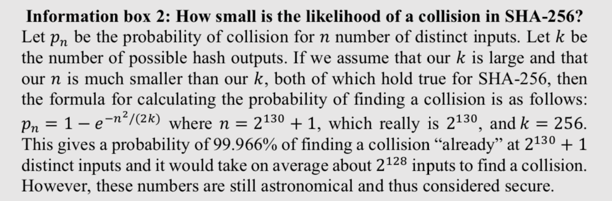
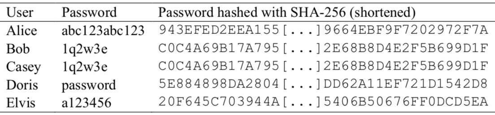
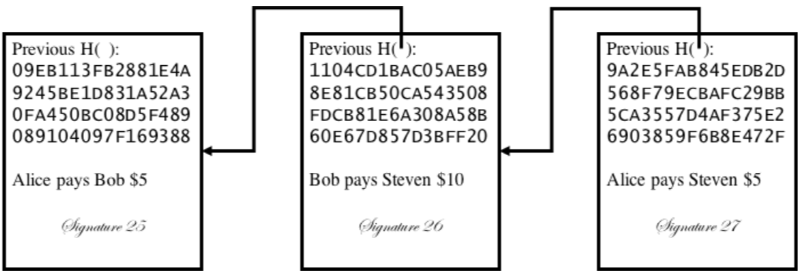
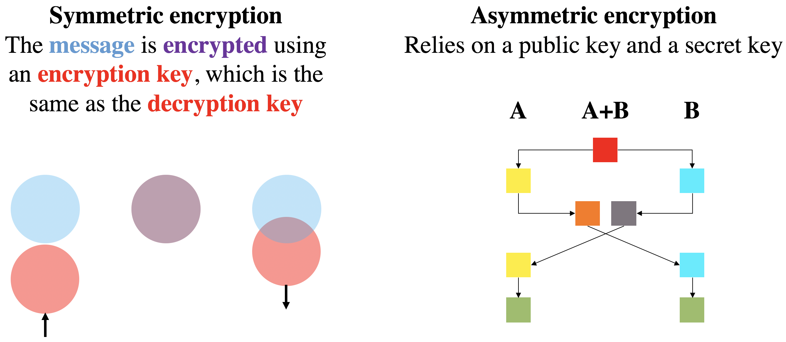
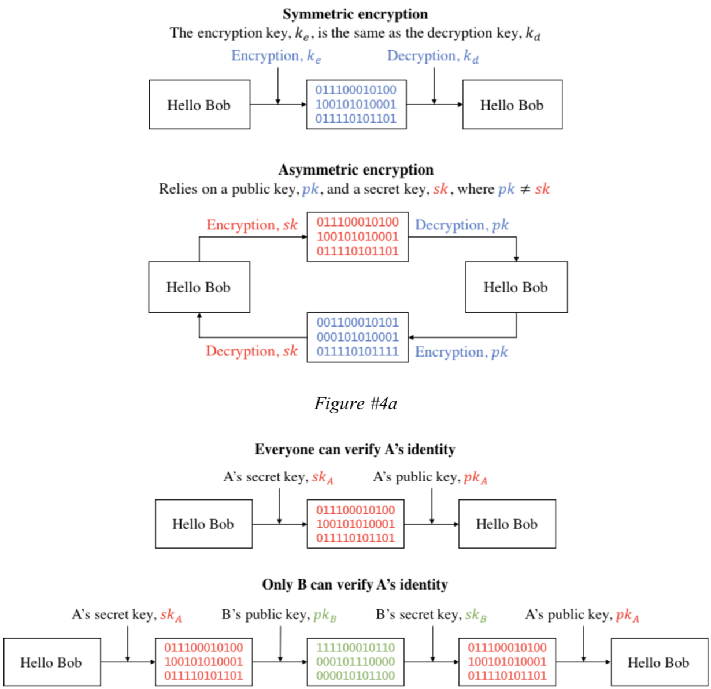

# A BLOCKCHAIN: THE BASIC BUILDING BLOCKS
Summary text THERE ARE TWO WAYS TO APPROACH THIS 1) KNOWLEDGE DOMAINS, 2) DATA STRUCTURE CONSENSUS MODEL AND ALGO

At the time of this writing, the word "blockchain" is used as a label for a whole range of digital technologies. Network topologies range from distributed to centralized, and from access rights from open and permissionless to closed networks where read and write rights require permission. This is, of course, in stark contrast to the original idea as introduced by Satoshi Nakamoto in 2008, where the blockchain was created to enable a distributed network of actors to engage in value transactions without having to rely on any centralized actor.

In this section, I will first introduce Nakamoto's original blockchain (from hereon referred to as the Nakamoto design). Then, I will describe some of the major developments that have taken place since 2008. Finally, I will purposefully depart from the original definition of a blockchain, and introduce the three major building blocks that characterize any blockchain today: The data structure, the consensus algorithm, and the consensus model.

## The Nakamoto design
For value exchanges to take place in a digital environment, we need a way to represent unique digital states. These digital states must be tamper proof and there cannot be any equivocality in terms of transactions, i.e., there can only be one single true state. One way to achieve this is to have a centralized ledger. This requires us to trust the actor in charge of maintaining and securing the ledger.

The blockchain is an alternative way of maintaining and securing such a digital ledger of value exchanges. It is completely decentralized, meaning that it does not require any coordinating central actor for it to ensure a unique digital state and a single source of truth.

But how does a blockchain achieve such an unequivocal and immutable ledger (i.e., a tamper proof history that everyone views as true)? The answer relies on the three main bodies of knowledge that a blockchain builds on: 1) cryptography, 2) peer to peer (P2P) networks, and 3) game theory. Blockchain as a technology lies at the intersection between these three bodies of knowledge as illustrated by the red area in Figure 1.

Figure 1. The three knowledge domains used in the Nakamoto design

Next, each is explained in detail.

## Cryptography and the blockchain
[Cryptography](https://en.wikipedia.org/wiki/Cryptography) is used to secure the past data state (i.e., what has already been appended to the blockchain) and the rules of what constitutes a valid addition to already existing data.

In Satoshi Nakamoto’s original blockchain design, cryptography is used in two main ways: 1) [cryptographic hash functions](https://simple.wikipedia.org/wiki/Cryptographic_hash_function), and 2) [digital signatures](https://simple.wikipedia.org/wiki/Digital_signature).

It is not necessary to understanding cryptographic hash functions to understand how a blockchain works. But without an understanding of how cryptography matters for the technology, one must trust that a blockchain's oft touted characteristics are true. But since "trustless" is supposed to be one of those alleged characteristics, trusting that it is trustless is an unacceptable irony!

### Cryptographic hash functions
A cryptographic hash function is a mathematical function that takes an input of arbitrary size and generates an output (a hash digest) of a fixed size in a reasonable amount of time.

The Namamoto design relies on two specific properties of cryptographic hash functions: 1) collision resistance, and 2) irreversibility.

#### Collision resistance
Collision resistance is the property of cryptographic hash functions to generate a unique hash digest for several data inputs. That is to say, a collision resistant hash function, $$F()$$, is one where it is *practically* unfeasible to find a collision such that $$F(a)=F(b)$$ and $$a≠b$$. This means that any two distinct inputs should always generate two distinct outputs.

To illustrative a collision, assume that our hash function, $$F()$$, was the modulo of a number, $$a mod n$$. Here, it is easy to find a collision, e.g., $$a mod 1$$ generates a collision as the remainder is 0 for every $$a$$.

A collision resistant cryptographic hash function is one where it takes an unfeasibly long amount of time to find a collision. Taking SHA256 as an example, the best collision attack is still brute force $$2^(256/2)$$ (other SHA functions have different security against collision attacks, as [described here](https://en.wikipedia.org/wiki/Template:Comparison_of_SHA_functions)). Infobox 2 contains more information about how difficult it is to find a single collision (of the infinite amount that exist) in SHA256; it is sufficient to know that it is practically impossible given the large numbers involved.

Information box 2. Collisions in SHA256.

Another great source to understand the likelihood is [2blue1brown's explanation on youtube](https://www.youtube.com/watch?v=S9JGmA5_unY).

The practical use of collision resistance in chained ledgers (see here for a discussion on how hash digests are used in chained ledgers) is that we can be certain that the past data state (e.g., the past documents) is one that we all agree on. If someone would find a collision, that person could create an alternative history that looks correct as it has the same hash digest, but where actors agree on different histories.

#### Irreversibility
While collision resistance is an important property of cryptographic hash functions, it only serves to create distinct outputs from distinct inputs. In addition, we also want to make sure that the data input cannot be reconstructed from the hash digest, i.e., we need the cryptographic hash function to be irreversible.

Why does irreversibility matter and how does it relate to collision resistance? Let us use an illustrative example of managing user passwords. **Table 1** contains a list of users and their (poorly picked) passwords.

Table 1. Why irreversibility matters

Hashing passwords obfuscates the original password making it much harder for an attacker to get access to the list of passwords. When a user supplies their password in plain text, it is hashed and the password is only accepted if its hash output matches the one stored in the database. But take a closer look at **Table 1** and note that Bob and Casey have the same password and, consequently, hash. This is not ideal.

The reason for why it is not ideal is that the passwords can be revealed using a frequency analysis. Frequency analysis makes use of the knowledge that it is common for people to pick passwords in a non-random way, e.g., ‘1q2w3e.’ We can hash a list of common passwords and match the output with our list in **Table 1**. When we find a hit (which we will) we will immediately identify every single user who has picked the same password (which many do).

As mentioned, collision resistance is only a part of the desired properties we want cryptographic hash functions to have. Our example in **Table 1** clearly was not suitable given that the hash output contained clues about the hash input (i.e., frequency suggestion that it is a common password). One way to generate distinct outputs is to concatenate the user’s password with another random-like input, e.g., dice rolls. Say that we will roll a fair dice 10 times and append the series to the password. That is to say, if Bob rolls 2253263313, we add this number to his password, i.e., 1q2w3e2253263313, and hash that. Since it is unlikely that Casey will roll the same dice sequence as Bob did, their concatenated passwords are distinct inputs and will thus generate distinct outputs as long as the hash function is collision resistant.

In a cryptographic hash function, we can concatenate random values to other values and create hash outputs that do not provide any clues of the data inputs. Formally stated, we concatenate (indicated using the ∥ sign) a random value, 𝑟, to the data input, 𝑥, so that the generated hash output, 𝑦 = 𝐻(𝑟 ∥ 𝑥), contains no information about 𝑥. If the likelihood of generating the same random value (called a *nonce*, cf. sections XYZ) is small enough then we have achieved *practical* irreversibility.

#### Cryptographic hash functions: Synthesis
Cryptographic hash functions are fundamental to blockchains built on the Nakamoto design. These functions are used in two main ways: i) in how we structure and store data, and ii) in securing the integrity of the data state of a public decentralized ledger. But before we know how that works, we need to know more about how the blockchain is structured.

We could use something similar to anders blockchain demo here for each of these steps. One for the simple hash digest. Another for the collision resistance part. Then one for the irreversibility. And finally one that shows how collision resistant hash functions are used for i) and ii) above. i) by securing tamper proof nature. ii) by making sure that everyone can validate the entire blockchain

One key concept to understand how blockchains use cryptographic hashing functions is the *hash pointer*. Elsewhere, we introduced the concept of a hash linked document chain. Here, we expand on this concept by detailing the nature of these hash links.

If we use a ledger (or any other data state) as the input to a hashing function, we generate a hash digest that is unique to that ledger. Now, if we include that hash digest as part of the next document in the document chain, we create a hash pointer to the previous document. A hash pointer is simply a way to show where some information is stored in a data structure.

As an analogy, the index of a book contains pointers to information stored on the indexed page with the corresponding number. However, such a pointer does not contain information about the data integrity stored on that page. If the index contains also a hash digest of the indexed page, we generate a hash pointer that also contains a cryptographic hash of the value of the page we reference to. Put differently: a hash pointer references both the location of data as well as provides information about the integrity of these data. Any changes in the data that our hash pointer refers to, would also change the hash digest of our pointer. In other words, we would create a cryptographically linked chain of data blocks (you may now realize how unimaginative the name ‘blockchain’ is).

Each block in a blockchain contains a data field that both points to a previous block as well as contain the digest (i.e., the irreversible hash output) of the data in that previous block. This can be used to create an append only (meaning that we can add but not change existing) data log where any alteration to the history requires that we rehash the cryptographic links in subsequent blocks. **Figure hashlink** illustrates this.

Hashlinked data chain shitty photo, we can do better

Note that if we change anything in the middle block in Figure hashlink, the block to the left remains unaltered since the hash pointer refers to previous data and not subsequent data. But what happens to the block to the right? Well, since the hash pointer uses the hash output of the data contained in the previous block, any change in the middle block would result in a change in the previous 𝐻() value in the right block. For example, say that Bob wants to change the data in the middle block to state that he only paid $1 to Steve. This alteration changes its hash to `99E1EE8C764ABE97301EFC59DB9560694E1EB1922A0CD6981CE0951FC14B7410`, which no longer is the same as the hash pointer of the right block.

Figure hashlink illustrates why it is important that cryptographic hash functions are collision resistant. Collision resistance makes it difficult to alter data in a single block without having to rehash every subsequent block. How is this useful? Well, imagine a situation where Alice, Bob, and Steven all share a copy of a ledger. If a fourth person, Greg, joins the group he can verify whether the group is or not in agreement around the historical state of data by downloading the ledger and comparing the hash pointers (Greg does not need to see the entire data).

The Nakamoto design relies on this same principle of hash pointers that need to be verified. It is through such hash pointers that a decentralized network can reach consensus around what is a valid data state without any central coordination! A new node does not need anyone to tell it what the correct data state is, it can download a copy of the ledger from any nodes it can connect to, and verify that it has a valid copy by confirming the hash pointers (exactly how this is done we cover elsewhere).

### Digital signatures
The Nakamoto blockchain utilizes cryptographic digital signatures to sign value exchanges or to provide proof of ownership.

Let us begin with listing the properties we need in order for digital signatures to sign value exchanges and provide proof of ownership.
1. Only one actor should be able to sign but everyone should be able to verify a signature.
2. A digital signature should only work with what it signed and it should not work with anything else, i.e., a specific transaction's signature should not be useable for signing other transactions.

If we can achieve these two things we get a valid digital signature that allows us to trust that: a) the value exchange or ownership claim is created by a known sender (referred to as authentication), b) that the state of a transaction or claim (e.g., that the money has been or has not been sent) cannot be challenged (referred to as non-repudiation), and c) that  all information about the value exchange or proof of ownership has not been altered (referred to as integrity).

In other words, digital signatures allow us to use math to know that a transaction has happened (or not), to know that the transaction came from where it should have come from and arrived to where it was intended to arrive, and that there is no risk of counterfeits. Prior to the Nakamoto blockchain, this was impossible to do without a centralized ledger and trusted third parties. The Nakamoto design, instead, relies on something called public-key (or asymmetric) cryptography.

Encryption is very hard to explain, but very easy to illustrate. For the simple version we ca use colors. For the more advanced version we can use actual process. Both are shown in pictures below.

easy

hard

Also, tons of other process images online for how this works.

Suffice to say, digital signatures have been used for decades in software distribution, transactions, and contract management. It is a not a new technology, it is merely the application of what already exists in a new way, i.e., P2P transactions using blockchains. Interestingly, in such P2P networks, your secret key, also known as your private key, becomes the way you provide proof of the digital representation of your real-world persona, i.e., your public key.

## Decentralized P2P networks
In a permissionless public network, anyone can join the network and become a *node*. Once joined, a new node will download the blockchain from other nodes in the network and then start the process of verifying that the blockchain is correct (by checking the hash pointers contained in the data structure).

But getting the historical data is only the first part of the problem that we need to solve to enable decentralization. The second one is to make sure that everyone in the network agrees on what new data to append. This is where another use of hash digests come into play, i.e., a search puzzle (note that this is only the case in blockchains that utilize the Nakamoto design). REFERENCE TO CONSENSUS ALGOS AROUND HERE.
